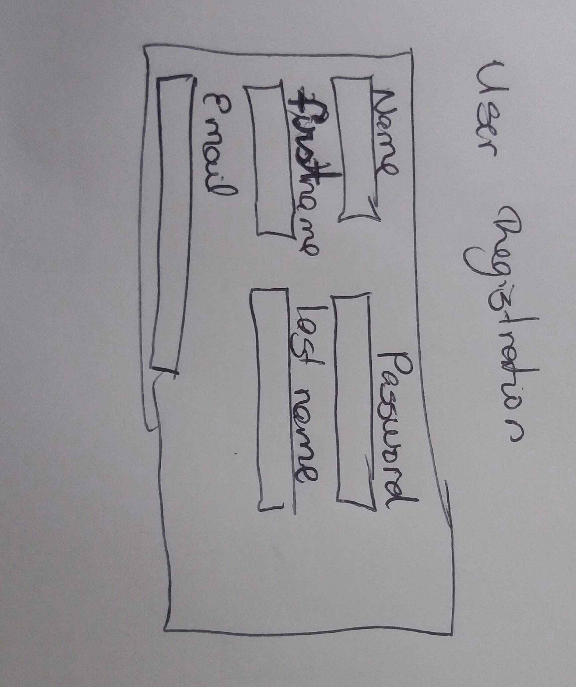

# Aury Rodriguez 07/12/2017<h1> 
## My project: Places to go. <h2> 

## It's an app where an user can have a list of the places that  would like to visit. The user only has to specify  the contry and the city and it would list the places , the user should . <h2> 
##The User can select the places , from that list, that he/she would like to go.

* You'll have 
- User .
    id, userName, password, email, firstName, lastName

- Country
    id, countryName, langua, currency, details, 
- Places
    id, userId, countryId, status, review

## Wireframe

