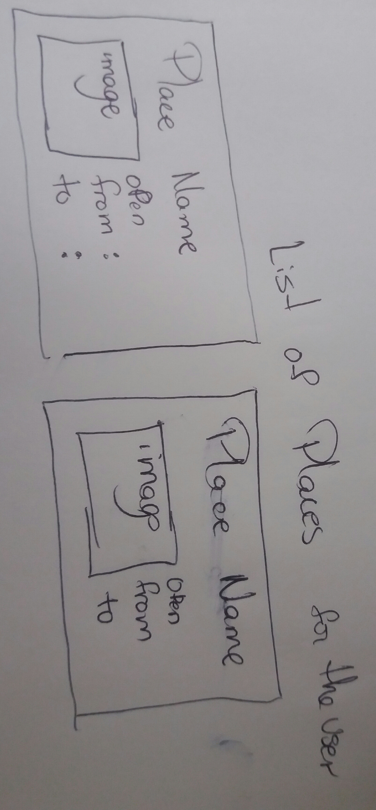

# Aury Rodriguez 07/12/2017<h1> 
## My project: Places to go. <h2> 
### An app where user can check the places to visit around the world<h3>

## User Stories <h2>
### The user would specify a country and / or a city , and it will retrieve information about places (hotels, buidings,monuments, etc.). If the user log in he/she would be able to create its own list of places, add information, and plan a trip. <h3> 


## Wireframe





## The technologies, APIs, and modules <h2>
	*Technologies	
	-HTML
	-JavaScript
	-Css
	*NPM
	-express
	-morgan
	-path
	-body-parser
	-method-override
	-cookie-parser
	-express-session
	-passport
	*API's
	-Google Places (Retieve the places info)
	-Google Images (Retrieve the Images depending of the result of the previos API )


	## This is the code  that I'm proud of <h2>
```
  let  promiseArray = imagesArray.map(function(photo_reference,index){
            if (photo_reference!=="./images/noImage.jpg"){
                return fetch(`https://maps.googleapis.com/maps/api/place/photo?maxwidth=600&key=${process.env.google_API}&photoreference=${photo_reference}`)
                        .then(function(images) {
                            return images.url
                         });
            }else{

              return photo_reference
            }

        });

        Promise.all(promiseArray).then(function(response){
            res.locals.imagesUrl =response;
            return next();
        });


```

##Something That I would love to add is more information about the place. i already have the APi to use for that <h2>
